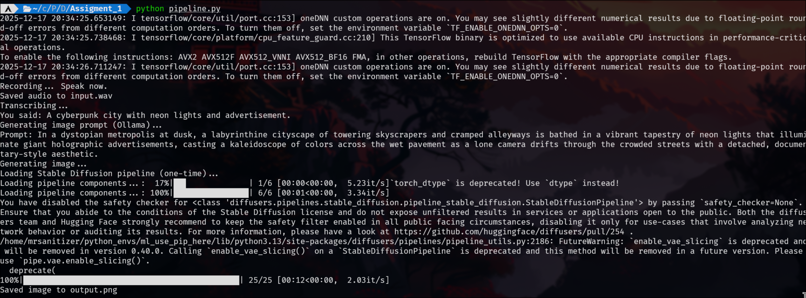

# Speech-to-Image Pipeline (Fully Local)

This project records your voice, converts speech to text using **Whisper**, transforms that text into a **Stable Diffusion image prompt using a local LLM (Ollama)**, and finally generates an image using **Stable Diffusion**. We have a system propmt to llm     system_prompt = (
        "Convert the user text into ONE Stable Diffusion prompt.\n"
        "Make it visual: subject, setting, lighting, mood, camera, style.\n"
        "No explanations; output only the prompt text."
    )

Everything runs **locally** after models are downloaded — no cloud APIs, no paid services.

---

## Pipeline Overview

```
Microphone
   ↓
Whisper (Speech → Text)
   ↓
Ollama LLM (Text → Image Prompt)
   ↓
Stable Diffusion (Prompt → Image)
```

---

Recording... Speak now.
Saved audio to input.wav
Transcribing...
You said: A cyberpunk city with neon lights and advertisement.
Generating image prompt (Ollama)...
Prompt: In a dystopian metropolis at dusk, a labyrinthine cityscape of towering skyscrapers and cramped alleyways is bathed in a vibrant tapestry of neon lights that illuminate giant holographic advertisements, casting a kaleidoscope of colors across the wet pavement as a lone camera drifts through the crowded streets with a detached, documentary-style aesthetic.
Generating image...
the process

The final output

## Features

-  Record audio from your microphone
-  Speech-to-text using OpenAI Whisper
-  Prompt generation using Ollama (local LLM)
-  Image generation using Stable Diffusion v1.5
-  CUDA GPU acceleration (if available)
-  Models are cached and reused between runs

---

## 🖥 System Requirements

### Minimum
- Linux (tested on Arch Linux)
- Python 3.10+
- 8 GB RAM
- CPU-only supported (slow)

### Recommended
- NVIDIA GPU (≥ 6 GB VRAM)
- CUDA installed
- 16 GB RAM

---

## System Dependencies (Arch Linux)

```bash
sudo pacman -S python python-pip portaudio ffmpeg
```

- `portaudio` → required for microphone input
- `ffmpeg` → required by Whisper

---

## Python Setup

Install Python dependencies:

```bash
pip install \
  numpy \
  sounddevice \
  scipy \
  requests \
  torch \
  diffusers \
  transformers \
  accelerate \
  safetensors\
  openai-whisper
```

---

## Ollama Setup (Local LLM)

Install Ollama:

```bash
sudo pacman -S ollama
```

Start the Ollama server:

```bash
sudo systemctl start ollama.service
ollama serve
```

Pull the required model:

```bash
ollama pull llama3.1:8b
```

The script uses:

```python
OLLAMA_MODEL = "llama3.1:8b"
```


---

##  Running the Program

```bash
python main.py
```

---

## What Happens When You Run It

1. Records audio for **10 seconds**
2. Saves audio as `input.wav`
3. Whisper transcribes speech to text
4. Ollama converts text into a **single Stable Diffusion prompt**
5. Stable Diffusion generates an image
6. Image is saved as `output.png`

---

## Output Files

| File        | Description |
|------------|------------|
| `input.wav` | Recorded microphone audio |
| `output.png` | Generated image |

---

## ⚙️ Configuration Options

You can modify these in the script:

```python
DURATION = 10            # Recording time (seconds)
WIDTH = 512              # Image width
HEIGHT = 512             # Image height
STEPS = 25               # Diffusion steps
GUIDANCE = 7.5           # CFG scale
```

---

## 🐛 Troubleshooting

### Microphone not detected
- Ensure `portaudio` is installed
- Check available devices:
```bash
python -m sounddevice
```

### CUDA not detected
- Verify:
```bash
python - <<EOF
import torch
print(torch.cuda.is_available())
EOF
```

### Ollama connection error
- Make sure Ollama is running:
```bash
ollama serve
```

---

## License

This project is for **educational and personal use**.  
Model licenses apply individually (Whisper, Stable Diffusion, Ollama models).

---

## Credits

- OpenAI Whisper
- Hugging Face Diffusers
- Ollama

---
